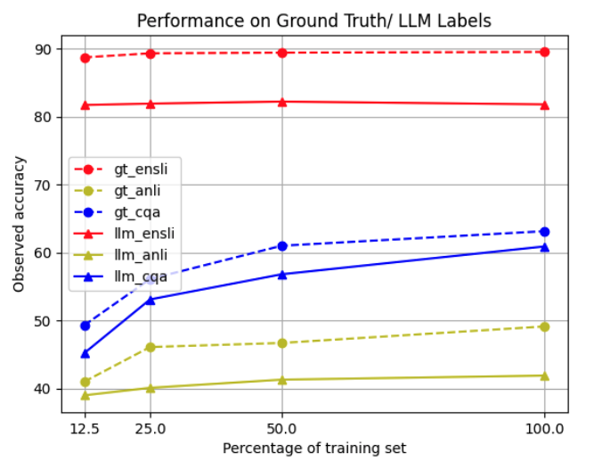

# Distilling Step-by-Step!

Code for paper [Distilling Step-by-Step! Outperforming Larger Language Models with Less Training Data and Smaller Model Sizes](https://arxiv.org/abs/2305.02301)

## This code is to perform an indepth analysis and replication of the claimed results on the paper cited above.

## Team details:

1. Nikhil Dilip Dhore G01383804
2. Anish Kumar Saranga G01376251
3. Sai Srivathsa Muthyala G01391091

## Environment Setup

- Setup environment and install dependencies:

```
pip install -r requirements.txt
```

packages include: pytorch, torchaudio, torchvision, transformers etc.

- Extract datasets to `datasets/`:

```
unzip datasets.zip
```

## Command Usages

#### Args usages

- `--from_pretrained`: `google/t5-v1_1-small`, `google/t5-v1_1-base`, `google/t5-v1_1-large`, `google/t5-v1_1-xxl`
- `--dataset`: `esnli`, `anli1`, `cqa`
- `--label_type`:
  - `--label_type gt`: Use GT label for training
  - `--label_type llm`: Use LLM predicted label for training
- `--alpha`: Task weight for multi-task training. Loss = alpha _ label_prediction_loss + (1 - alpha) _ rationale_generation_loss
  - `--alpha 0.5`: recommended
- `--batch_size`: Batch size
- `--grad_steps`: Gradient accumulation step
- `--max_input_length`: Maximum input length
- `--eval_steps`: How many steps to evaluate the model during training
- `--max_steps`: Maximum steps for training
- `--run`: Random seed to use
- `--model_type`:
  - `standard`: Standard finetuning (`--label_type gt`) or distillation (`--label_type llm`)
  - `task_prefix`: Distilling step-by-step
- `--parallelize`: Model parallelism

#### Example usages

- Standard finetuning:

```python
python run.py --from_pretrained google/t5-v1_1-base --dataset cqa --model_type standard --label_type gt --batch_size 64
```

- Distilling step-by-step with `GT label` and `PaLM rationale`:

```python
python run.py --from_pretrained google/t5-v1_1-base --dataset cqa --model_type task_prefix --label_type gt --llm palm --alpha 0.5 --batch_size 64
```

- Standard distillation:

```python
python run.py --from_pretrained google/t5-v1_1-base --dataset cqa --model_type standard --label_type llm --batch_size 64
```

- Distilling step-by-step with `PaLM label` and `PaLM rationale`:

```python
python run.py --from_pretrained google/t5-v1_1-base --dataset cqa --model_type task_prefix --label_type llm --llm palm --alpha 0.5 --batch_size 64
```

#### If you want to directly reproduce all the results, a bash file can be executed as below. Note that this includes dealing with all the combinations of above given commands, so will take very long time to run even on high capacity of GPUs.

```
./execute.sh
```

#### Some analysis done include performance of T5_base model on Ground Truth and LLM generated labels on varying sizes of training data.



## Cite

If you find the paper interesting, please consider citing the authors:

```bibtex
@article{hsieh2023distilling,
  title={Distilling step-by-step! outperforming larger language models with less training data and smaller model sizes},
  author={Hsieh, Cheng-Yu and Li, Chun-Liang and Yeh, Chih-Kuan and Nakhost, Hootan and Fujii, Yasuhisa and Ratner, Alexander and Krishna, Ranjay and Lee, Chen-Yu and Pfister, Tomas},
  journal={arXiv preprint arXiv:2305.02301},
  year={2023}
}
```
